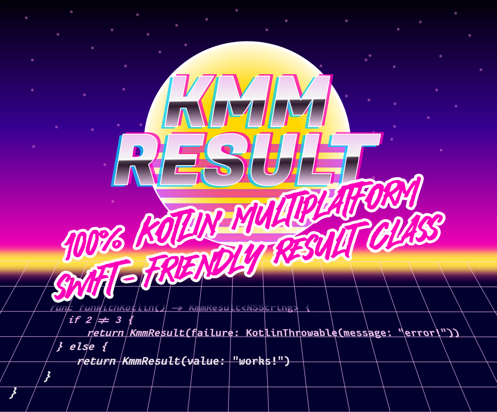

<div align="center">




# Swift-Friendly Kotlin Multiplatform Result Class

[](http://www.apache.org/licenses/LICENSE-2.0)


[![A-SIT Plus Official](https://img.shields.io/badge/A--SIT_Plus-official-005b79?logo=data%3Aimage%2Fsvg%2Bxml%3Bbase64%2CPHN2ZyB4bWxucz0iaHR0cDovL3d3dy53My5vcmcvMjAwMC9zdmciIHZpZXdCb3g9IjAgMCAxNDMuNzYyODYgMTg0LjgxOTk5Ij48ZGVmcz48Y2xpcFBhdGggaWQ9ImEiIGNsaXBQYXRoVW5pdHM9InVzZXJTcGFjZU9uVXNlIj48cGF0aCBkPSJNMCA1OTUuMjhoODQxLjg5VjBIMFoiLz48L2NsaXBQYXRoPjwvZGVmcz48ZyBjbGlwLXBhdGg9InVybCgjYSkiIHRyYW5zZm9ybT0ibWF0cml4KDEuMzMzMzMzMyAwIDAgLTEuMzMzMzMzMyAtNDgyLjI1IDUxNy41MykiPjxwYXRoIGZpbGw9IiMwMDViNzkiIGQ9Ik00MTUuNjcgMjQ5LjUzYy03LjE1LjA4LTEzLjk0IDEtMjAuMTcgMi43NWE1Mi4zMyA1Mi4zMyAwIDAgMC0xNy40OCA4LjQ2IDQwLjQzIDQwLjQzIDAgMCAwLTExLjk2IDE0LjU2Yy0yLjY4IDUuNDEtNC4xNCAxMS44NC00LjM1IDE5LjA5bC0uMDIgNi4xMnYyLjE3YS43MS43MSAwIDAgMCAuNy43M2gxNi41MmMuMzkgMCAuNy0uMzIuNzEtLjdsLjAxLTIuMmMwLTIuNi4wMi01LjgyLjAzLTYuMDcuMi00LjYgMS4yNC04LjY2IDMuMDgtMTIuMDZhMjguNTIgMjguNTIgMCAwIDEgOC4yMy05LjU4IDM1LjI1IDM1LjI1IDAgMCAxIDExLjk2LTUuNTggNTUuMzggNTUuMzggMCAwIDEgMTIuNTgtMS43NmM0LjMyLjEgOC42LjcgMTIuNzQgMS44YTM1LjA3IDM1LjA3IDAgMCAxIDExLjk2IDUuNTcgMjguNTQgMjguNTQgMCAwIDEgOC4yNCA5LjU3YzEuOTYgMy42NCAzIDguMDIgMy4xMiAxMy4wMnYyNC4wOUgzNjIuNGEuNy43IDAgMCAwLS43MS43VjMzNWMwIDguNDMuMDEgOC4wNS4wMSA4LjE0LjIgNy4zIDEuNjcgMTMuNzcgNC4zNiAxOS4yMmE0MC40MyA0MC40MyAwIDAgMCAxMS45NiAxNC41N2M1IDMuNzYgMTAuODcgNi42MSAxNy40OCA4LjQ2YTc3LjUgNzcuNSAwIDAgMCAyMC4wMiAyLjc3YzcuMTUtLjA3IDEzLjk0LTEgMjAuMTctMi43NGE1Mi4zIDUyLjMgMCAwIDAgMTcuNDgtOC40NiA0MC40IDQwLjQgMCAwIDAgMTEuOTUtMTQuNTdjMS42Mi0zLjI2IDMuNzctMTAuMDQgMy43Ny0xNC42OCAwLS4zOC0uMTctLjc0LS41NC0uODJsLTE2Ljg5LS40Yy0uMi0uMDQtLjM0LjM0LS4zNC41NCAwIC4yNy0uMDMuNC0uMDYuNi0uNSAyLjgyLTEuMzggNS40LTIuNjEgNy42OWEyOC41MyAyOC41MyAwIDAgMS04LjI0IDkuNTggMzUuMDEgMzUuMDEgMCAwIDEtMTEuOTYgNS41NyA1NS4yNSA1NS4yNSAwIDAgMS0xMi41NyAxLjc3Yy00LjMyLS4xLTguNjEtLjcxLTEyLjc1LTEuOGEzNS4wNSAzNS4wNSAwIDAgMS0xMS45Ni01LjU3IDI4LjUyIDI4LjUyIDAgMCAxLTguMjMtOS41OGMtMS44Ni0zLjQ0LTIuOS03LjU1LTMuMDktMTIuMmwtLjAxLTcuNDdoODkuMTZhLjcuNyAwIDAgMCAuNy0uNzJ2LTM5LjVjLS4xLTcuNjUtMS41OC0xNC40LTQuMzgtMjAuMDZhNDAuNCA0MC40IDAgMCAwLTExLjk1LTE0LjU2IDUyLjM3IDUyLjM3IDAgMCAwLTE3LjQ4LTguNDcgNzcuNTYgNzcuNTYgMCAwIDAtMjAuMDEtMi43N1oiLz48cGF0aCBmaWxsPSIjY2U0OTJlIiBkPSJNNDE5LjM4IDI4MC42M2gtNy41N2EuNy43IDAgMCAwLS43MS43MXYxNS40MmE4LjE3IDguMTcgMCAwIDAtMy43OCA2LjkgOC4yOCA4LjI4IDAgMCAwIDE2LjU0IDAgOC4yOSA4LjI5IDAgMCAwLTMuNzYtNi45di0xNS40MmEuNy43IDAgMCAwLS43Mi0uNzEiLz48L2c%2BPC9zdmc%2B&logoColor=white&labelColor=white)](https://a-sit-plus.github.io)
[](http://kotlinlang.org)
[](http://kotlinlang.org)

[](https://mvnrepository.com/artifact/at.asitplus/kmmresult/)


</div>


Wrapper for `kotlin.Result` with KMM goodness, s.t. it becomes possible to expose a result class to 
public APIs interfacing with platform-specific code. For Kotlin/Native (read: iOS), this requires a `Result` equivalent, which
is *not* a value class (a sealed `Either` type also does not interop well with Swift). 

`KmmResult` comes to the rescue! → [Full documentation](https://a-sit-plus.github.io/KmmResult/).

## Using in your Projects

This library is available at maven central.

### Gradle

```kotlin
dependencies {
    api("at.asitplus:kmmresult:$version")   //This library was designed to play well with multiplatform APIs
}                                           //and is therefore intended to be exposed through your public API
```

## Quick Start
Creation of `Success` and `Failure` objects is provided through a companion:

```kotlin
var intResult = KmmResult.success(3)
intResult = KmmResult.failure (NotImplementedError("Not Implemented"))
```

Convenience functions:
- `map()`  transforms success types while passing through errors
- `mapFailure` transforms error types while passing through success cases
- the more generic `fold()` is available for conveniently operating on both success and failure branches
- `KmmResult` sports `unwrap()` to conveniently map it to the `kotlin.Result` equivalent
- `Result.wrap()` extension function goes the opposite way
- `mapCatching()` does what you'd expect
- `wrapping()` allows for wrapping the failure branch's exception unless it is of the specified type

Refer to the [full documentation](https://a-sit-plus.github.io/kmmresult/) for more info. 

### Java
Works from the JVM as expected:

```java
KmmResult<Boolean> demonstrate() {
    if (new Random().nextBoolean())
        return KmmResult.failure(new NotImplementedError("Not Implemented"));
    else
        return KmmResult.success(true);
}
```

### Swift
Use the initializers:

```swift
func funWithKotlin() -> KmmResult<NSString> {
    if 2 != 3 {
        return KmmResult(failure: KotlinThrowable(message: "error!"))
    } else {
        return KmmResult(value: "works!")
    }
}
```

## Non-Fatal-Only `catching`
KmmResult comes with `catching`. This is a non-fatal-only-catching version of stdlib's `runCatching`, directly returning a `KmmResult`.
It re-throws any fatal exceptions, such as `OutOfMemoryError`. The underlying logic is borrowed from [Arrow's](https://arrow-kt.io)'s
[`nonFatalOrThrow`](https://apidocs.arrow-kt.io/arrow-core/arrow.core/non-fatal-or-throw.html).

The only downside of `catching` is that it incurs instantiation overhead, because it creates a `KmmResult` instance.
Internally, though, only the behaviour is important, not Swift interop. Hence, you don't care for a `KmmResult` and you
certainly don't care for the cost of instantiating an object. Here, the `Result.nonFatalOrThrow()` extension shipped with KmmResult
comes to the rescue. It does exactly what the name suggest: It re-throws any fatal exception and leaved the `Result` object
untouched otherwise.  
In addition, there's `catchingPlain` which directly returns an stdlib `Result`

Happy folding!

## Contributing
External contributions are greatly appreciated!
Just be sure to observe the contribution guidelines (see [CONTRIBUTING.md](CONTRIBUTING.md)).


<br>

---

<p align="center">
The Apache License does not apply to the logos, (including the A-SIT logo) and the project/module name(s), as these are the sole property of
A-SIT/A-SIT Plus GmbH and may not be used in derivative works without explicit permission!
</p>
