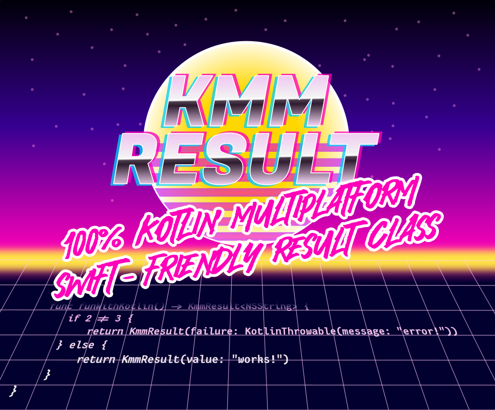

<div align="center">




# Swift-Friendly Kotlin Multiplatform Result Class

[](https://plus.a-sit.at/open-source.html)
[](http://www.apache.org/licenses/LICENSE-2.0)
[](http://kotlinlang.org)
[](http://kotlinlang.org)

[](https://developer.android.com/tools/releases/platforms#5.0)
[](https://mvnrepository.com/artifact/at.asitplus/kmmresult/)


</div>


Wrapper for `kotlin.Result` with KMM goodness, s.t. it becomes possible to expose a result class to 
public APIs interfacing with platform-specific code. For Kotlin/Native (read: iOS), this requires a `Result` equivalent, which
is *not* a value class (a sealed `Either` type also does not interop well with Swift). 

`KmmResult` comes to the rescue on *all* KMP targets! → [Full documentation](https://a-sit-plus.github.io/KmmResult/).

## Using in your Projects

This library is available at maven central.

### Gradle

```kotlin
dependencies {
    api("at.asitplus:kmmresult:$version")   //This library was designed to play well with multiplatform APIs
}                                           //and is therefore intended to be exposed through your public API
```

## Quick Start
Creation of `Success` and `Failure` objects is provided through a companion:

```kotlin
var intResult = KmmResult.success(3)
intResult = KmmResult.failure (NotImplementedError("Not Implemented"))
```

Convenience functions:
- `map()`  transforms success types while passing through errors
- `transform()` transforms a `KmmResult` of one type to another, leaving failure-cases untouched and preventing nested `KmmResult`s.
- `mapFailure` transforms error types while passing through success cases
- the more generic `fold()` is available for conveniently operating on both success and failure branches
- `KmmResult` sports `unwrap()` to conveniently map it to the `kotlin.Result` equivalent
- `Result.wrap()` extension function goes the opposite way
- `mapCatching()` does what you'd expect
- `wrapping()` allows for wrapping the failure branch's exception unless it is of the specified type
- `onSuccess()` and `onFailure()` transforming success and error cases, respectively.

Refer to the [full documentation](https://a-sit-plus.github.io/KmmResult/) for more info. 

### Java
Works from the JVM as expected:

```java
KmmResult<Boolean> demonstrate() {
    if (new Random().nextBoolean())
        return KmmResult.failure(new NotImplementedError("Not Implemented"));
    else
        return KmmResult.success(true);
}
```

### Swift
Use the initializers:

```swift
func funWithKotlin() -> KmmResult<NSString> {
    if 2 != 3 {
        return KmmResult(failure: KotlinThrowable(message: "error!"))
    } else {
        return KmmResult(value: "works!")
    }
}
```


### Kotest Extensions
The `kmmresult-test` artefact provides first-class Kotest integration:
* `catching {…} should suceed`
* `catching {…} shouldSucceedWith someSuccessValue`
* `catching {…}.shouldSucceed()` returns the value of the success case. Causes a failed assertion otherwise.

## Non-Fatal-Only `catching`
KmmResult comes with `catching`. This is a non-fatal-only-catching version of stdlib's `runCatching`, directly returning a `KmmResult`.
It re-throws any fatal exceptions, such as `OutOfMemoryError`. The underlying logic is borrowed from [Arrow's](https://arrow-kt.io)'s
[`nonFatalOrThrow`](https://apidocs.arrow-kt.io/arrow-core/arrow.core/non-fatal-or-throw.html).

The only downside of `catching` is that it incurs instantiation overhead, because it creates a `KmmResult` instance.
Internally, though, only the behaviour is important, not Swift interop. Hence, you don't care for a `KmmResult` and you
certainly don't care for the cost of instantiating an object. Here, the `Result.nonFatalOrThrow()` extension shipped with KmmResult
comes to the rescue. It does exactly what the name suggest: It re-throws any fatal exception and leaves the `Result` object
untouched otherwise.  As a convenience shorthand, there's `catchingUnwrapped` which directly returns an stdlib `Result`.

Happy folding!

## Contributing
External contributions are greatly appreciated!
Just be sure to observe the contribution guidelines (see [CONTRIBUTING.md](CONTRIBUTING.md)).


<br>

---

<p align="center">
The Apache License does not apply to the logos, (including the A-SIT logo) and the project/module name(s), as these are the sole property of
A-SIT/A-SIT Plus GmbH and may not be used in derivative works without explicit permission!
</p>
