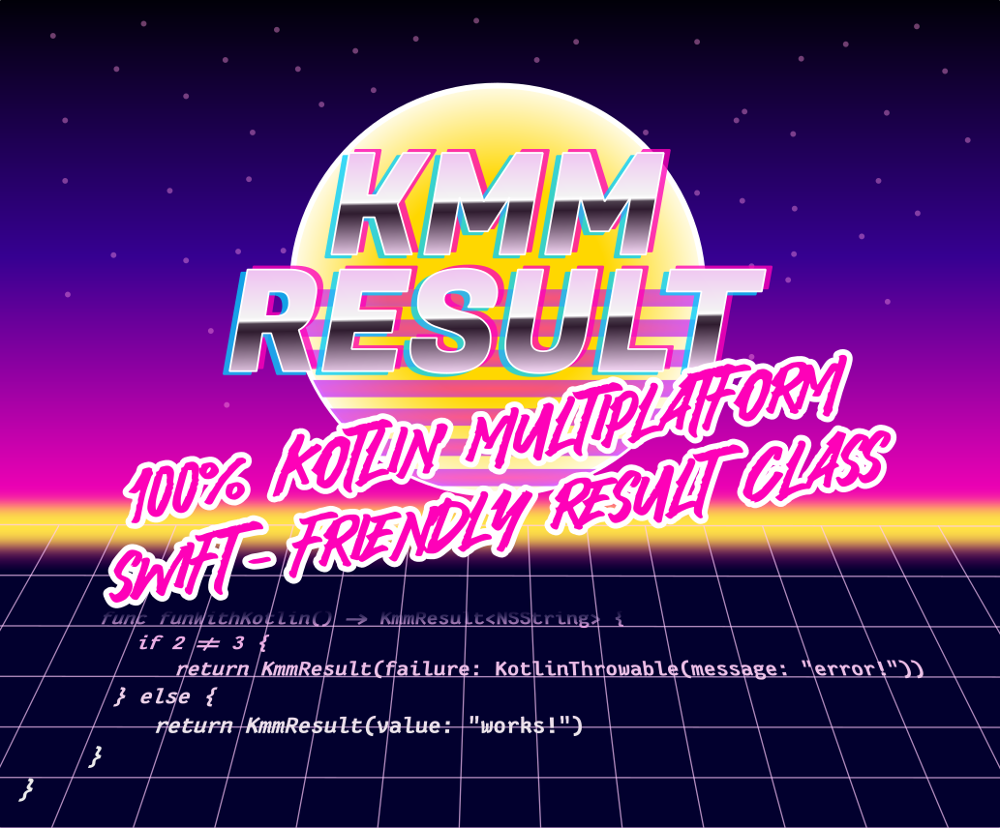

<div align="center">




# Swift-Friendly Kotlin Multiplatform Result Class

[](https://plus.a-sit.at/open-source.html)
[](http://www.apache.org/licenses/LICENSE-2.0)
[](http://kotlinlang.org)
[](http://kotlinlang.org)

[](https://developer.android.com/tools/releases/platforms#5.0)
[](https://mvnrepository.com/artifact/at.asitplus/kmmresult/)


</div>


Wrapper for `kotlin.Result` with KMM goodness. This makes it possible to expose a result class to 
public APIs interfacing with platform-specific code. For Kotlin/Native (read: iOS), this requires a `Result` equivalent, which
is *not* a value class (a sealed `Either` type also does not interop well with Swift). 

`KmmResult` comes to the rescue on *all* KMP targets! → [Full documentation](https://a-sit-plus.github.io/KmmResult/).

## Using in your Projects

This library is available at Maven Central.

### Gradle

```kotlin
dependencies {
    api("at.asitplus:kmmresult:$version")   //This library was designed to play well with multiplatform APIs
}                                           //and is therefore intended to be exposed through your public API
```

## Quick Start
Creation of `Success` and `Failure` objects is provided through a companion:

```kotlin
var intResult = KmmResult.success(3)
intResult = KmmResult.failure(NotImplementedError("Not Implemented"))
```

Convenience functions:
- `map()`  transforms success types while passing through errors
- `transform()` transforms a `KmmResult` of one type to another, leaving failure-cases untouched and preventing nested `KmmResult`s.
- `mapFailure` transforms error types while passing through success cases
- the more generic `fold()` is available for conveniently operating on both success and failure branches
- `KmmResult` sports `unwrap()` to conveniently map it to the `kotlin.Result` equivalent
- `Result.wrap()` extension function goes the opposite way
- `mapCatching()` does what you'd expect
- `wrapping()` allows for wrapping the failure branch's exception unless it is of the specified type
- `onSuccess()` and `onFailure()` transforming success and error cases, respectively.

Refer to the [full documentation](https://a-sit-plus.github.io/KmmResult/) for more info. 

### Java
Works from the JVM as expected:

```java
KmmResult<Boolean> demonstrate() {
    if (new Random().nextBoolean())
        return KmmResult.failure(new NotImplementedError("Not Implemented"));
    else
        return KmmResult.success(true);
}
```

### Swift
Use the initializers:

```swift
func funWithKotlin() -> KmmResult<NSString> {
    if 2 != 3 {
        return KmmResult(failure: KotlinThrowable(message: "error!"))
    } else {
        return KmmResult(value: "works!")
    }
}
```


#### Native Swift `Result` conversion (iOS)

KmmResult bundles Swift helpers using [SKIE](https://skie.touchlab.co/features/swift-code-bundling).
The conversion itself does not throw: it returns Swift's native `Result` with Kotlin
exceptions in `.failure`. Calling Swift's `Result.get()` still throws on failure.

```swift
let kotlinResult = KmmResult<NSString>(value: "works!")
let native: Result<NSString?, Error> = Result(kotlinResult)
let string: Result<String, Error> = kotlinResult.swiftResult(as: String.self)

let kotlinArray = KmmResult<NSArray>(value: ["one", "two"] as NSArray)
let array: Result<[String], Error> = kotlinArray.swiftResult(as: [String].self)
```

`Result(kmmResult)` preserves the exported generic argument: `KmmResult<T>` becomes
`Result<T?, Error>`. The success value is optional because Kotlin's Objective-C
export erases generic nullability; a successful null stays `.success(nil)`.
The initializer extends Swift's native `Result`, so Swift can infer `T` from the
argument. Extending `KmmResult` directly cannot preserve `T` this way because
Swift restricts access to an Objective-C generic class's type argument in extensions.

`.swiftResult(as:)` checks and bridges the success value to a chosen Swift type.
Arrays bridge to native Swift arrays; their elements must match the requested type.
A type mismatch or null requested as a non-optional type becomes `.failure`.
Request an optional type, such as `String?.self`, to preserve successful null values.
The extension uses an Objective-C protocol bridge to work around Swift's restriction
on extending Objective-C generic classes; it does not infer the original `T`.

#### Maven publication and consumer setup

These helpers do not require a separately distributed Swift framework or Swift package.
SKIE stores their sources at `default/skie/swift` inside the published iOS KLIBs,
so they survive ordinary KMP publication through Maven Central and dependency resolution.
The SKIE plugin on the **final framework-producing module** extracts those sources
from dependency KLIBs and compiles them into that framework. Applying SKIE only to
KmmResult does not enable this in consumers automatically.

See the [SKIE Swift code bundling documentation](https://skie.touchlab.co/features/swift-code-bundling)
for source-set layout and framework bundling. The publication path is implemented in
[SwiftBundlingConfigurator](https://github.com/touchlab/SKIE/blob/main/SKIE/skie-gradle/plugin-impl/src/main/kotlin/co/touchlab/skie/plugin/switflink/SwiftBundlingConfigurator.kt)
(KLIB packing) and
[SwiftUnpackingConfigurator](https://github.com/touchlab/SKIE/blob/main/SKIE/skie-gradle/plugin-impl/src/main/kotlin/co/touchlab/skie/plugin/switflink/SwiftUnpackingConfigurator.kt)
(dependency extraction).

To include the helpers, consumers must:

- Apply a compatible SKIE plugin to the module producing their iOS framework or XCFramework.
  KmmResult uses [SKIE 0.10.15](https://skie.touchlab.co/changelog/0.10.15), which supports its Kotlin 2.4.20 compiler.
- Expose KmmResult as an `api` dependency and export it from that final framework
  with `export("at.asitplus:kmmresult:<version>")`, including when another KMP library
  sits between KmmResult and the framework-producing module.
- Keep [SKIE's Swift source bundling enabled](https://skie.touchlab.co/configuration/swift-code-bundling) (the default).

Import the resulting framework in Swift; the public helpers are part of that framework.
The standalone `KmmResult.xcframework` exports the module `KmmResultKit`
(`import KmmResultKit`). Its module name intentionally differs from the class name
`KmmResult`, preventing Swift from renaming the class to `KmmResult_`. When included
in another KMP framework, import that framework instead.
These helpers are iOS-only and cannot be called from Kotlin. Consumers producing a
framework without SKIE still receive the Kotlin API, but do not receive these Swift helpers.

#### Copy-paste fallback without SKIE

Copy this helper into the Swift application to preserve the generic argument:

```swift
extension Result where Failure == Error {
    init<T>(_ result: KmmResult<T>) where Success == T? {
        self.init { try result.getOrThrow() }
    }
}
```

This requires a KmmResult version with `@Throws(Throwable::class)` on `getOrThrow()`.
The annotation lets Kotlin failures become Swift errors; older unannotated exports
can terminate the process instead. The copy-paste helper provides the inferred
conversion; `.swiftResult(as:)` additionally requires the bundled protocol extension.

### Kotest Extensions
The `kmmresult-test` artifact provides first-class Kotest integration:
* `catching {…} should succeed`
* `catching {…}.shouldSucceed()` _(returns the value of the success case)_
* `catching {…}.shouldFail()` _(returns the caught exception)_
* `catching {…} shouldSucceedWith someSuccessValue`
* `catching {…}.shouldSucceedAnd otherMatcher(...)`
* `catching {…}.shouldSucceedAndNot otherMatcher(...)`

## Non-Fatal-Only `catching`
KmmResult comes with `catching`. This is a non-fatal-only-catching version of stdlib's `runCatching`, directly returning a `KmmResult`.
It re-throws any fatal exceptions, such as `OutOfMemoryError`. The underlying logic is [Arrow](https://arrow-kt.io)'s
[`nonFatalOrThrow`](https://apidocs.arrow-kt.io/arrow-core/arrow.core/non-fatal-or-throw.html).

The only downside of `catching` is that it incurs instantiation overhead, because it creates a `KmmResult` instance.
Internally, though, only the behavior is important, not Swift interop. Hence, you don't care for a `KmmResult` and you
certainly don't care for the cost of instantiating an object. Here, the `Result.nonFatalOrThrow()` extension shipped with KmmResult
comes to the rescue. It does exactly what the name suggests: It re-throws any fatal exception and leaves the `Result` object
untouched otherwise.  As a convenience shorthand, there's `catchingUnwrapped` which directly returns an stdlib `Result`.

Happy folding!

## Contributing
External contributions are greatly appreciated!
Just be sure to observe the contribution guidelines (see [CONTRIBUTING.md](CONTRIBUTING.md)).


<br>

---

<p align="center">
The Apache License does not apply to the logos, (including the A-SIT logo) and the project/module name(s), as these are the sole property of
A-SIT/A-SIT Plus GmbH and may not be used in derivative works without explicit permission!
</p>
